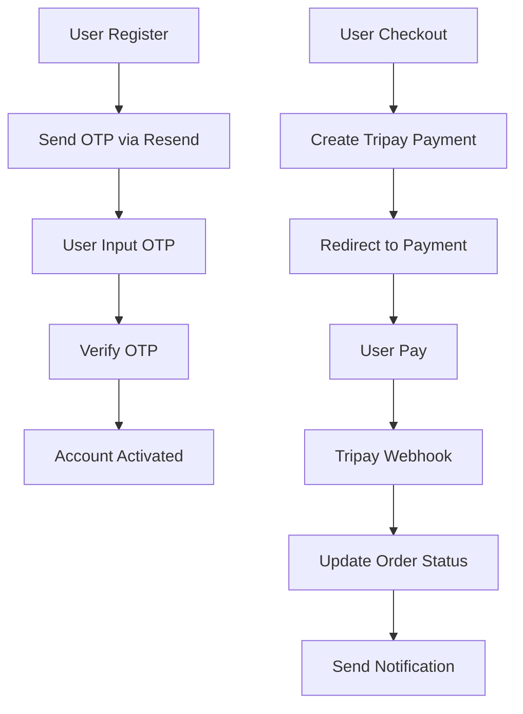

# Tutorial Lengkap Setup API Tripay & Resend

## Daftar Isi
1. [Persiapan Awal](#persiapan-awal)
2. [Setup API Tripay](#setup-api-tripay)
3. [Setup API Resend](#setup-api-resend)
4. [Konfigurasi Backend](#konfigurasi-backend)
5. [Testing & Verifikasi](#testing--verifikasi)
6. [Troubleshooting](#troubleshooting)

---

## Persiapan Awal

### Kebutuhan Sistem
- Akun Supabase (sudah terhubung)
- Akun Tripay untuk payment gateway
- Akun Resend untuk email service
- Dokumen bisnis (KTP, NPWP untuk Tripay)

### Struktur Project
```
ArfCODER/
├── supabase/
│   ├── functions/
│   │   ├── tripay-create-payment/
│   │   ├── tripay-webhook/
│   │   ├── send-otp/
│   │   └── verify-otp/
│   └── config.toml
├── src/
│   ├── pages/
│   │   ├── Checkout.tsx
│   │   └── EmailVerification.tsx
│   └── integrations/
└── TUTORIAL files
```

---

## Setup API Tripay

### 1. Pendaftaran Akun Tripay

**Langkah 1: Daftar Akun**
1. Buka [https://tripay.co.id](https://tripay.co.id)
2. Klik **"Daftar Merchant"**
3. Isi formulir pendaftaran:
   - Nama Lengkap
   - Email Aktif
   - Nomor Telepon
   - Password (min 8 karakter)
4. Verifikasi email yang dikirim Tripay
5. Login ke akun yang baru dibuat

**Langkah 2: Verifikasi Dokumen**
1. Login ke [Dashboard Tripay](https://tripay.co.id/member)
2. Menu **"Profil"** > **"Verifikasi Akun"**
3. Upload dokumen:
   - **KTP** (foto jernih, tidak blur)
   - **NPWP** (jika ada/bisnis)
   - **Foto Selfie** dengan KTP
4. Tunggu verifikasi **1-3 hari kerja**

**Langkah 3: Aktivasi Metode Pembayaran**
1. Setelah akun terverifikasi
2. Menu **"Pengaturan"** > **"Metode Pembayaran"**
3. Aktifkan metode yang diinginkan:
   - ✅ Virtual Account (BCA, Mandiri, BRI, BNI)
   - ✅ E-Wallet (DANA, OVO, ShopeePay)
   - ✅ QRIS
   - ✅ Retail (Alfamart, Indomaret)

### 2. Mendapatkan API Keys

**Sandbox (Testing):**
1. Dashboard > Menu **"API"** > **"Sandbox"**
2. Salin data berikut:
   ```
   API Key: tXXXX-sandboxkey-XXXXX
   Private Key: DEV-XXXXX-privatekey-XXXXX
   Merchant Code: TXXXXX
   ```

**Production (Live):**
1. Dashboard > Menu **"API"** > **"Production"** 
2. Salin data yang sama untuk production

### 3. Setting API Keys di Supabase

**Cara 1: Via Chat Lovable (Sudah Dilakukan)**
```
Secrets yang sudah ditambahkan:
✅ TRIPAY_API_KEY
✅ TRIPAY_PRIVATE_KEY  
✅ TRIPAY_MERCHANT_CODE
✅ TRIPAY_MODE
```

**Cara 2: Manual via Supabase Dashboard**
1. Buka [Supabase Dashboard](https://supabase.com/dashboard)
2. Pilih project **ArfCODER**
3. Menu **Settings** > **Edge Functions**
4. Tambahkan secrets:
   ```
   TRIPAY_API_KEY = [API Key dari dashboard]
   TRIPAY_PRIVATE_KEY = [Private Key dari dashboard]
   TRIPAY_MERCHANT_CODE = [Merchant Code dari dashboard]
   TRIPAY_MODE = sandbox (untuk testing) atau production (untuk live)
   ```

### 4. Mengisi API Keys

**Untuk Testing (Sandbox):**
```bash
TRIPAY_API_KEY = DEV-T1234567890123456789012345
TRIPAY_PRIVATE_KEY = DEV-abc123def456ghi789jkl012mno345
TRIPAY_MERCHANT_CODE = T1234
TRIPAY_MODE = sandbox
```

**Untuk Production:**
```bash
TRIPAY_API_KEY = [API Key Production Anda]
TRIPAY_PRIVATE_KEY = [Private Key Production Anda]  
TRIPAY_MERCHANT_CODE = [Merchant Code Production Anda]
TRIPAY_MODE = production
```

### 5. Setup Webhook URL

**Langkah Setup:**
1. Login Dashboard Tripay
2. Menu **"Pengaturan"** > **"Callback URL"**
3. Masukkan URL webhook:
   ```
   https://uoricbcevlvbvynejrsp.supabase.co/functions/v1/tripay-webhook
   ```
4. Klik **"Test Callback"** untuk memastikan berfungsi
5. **Simpan Pengaturan**

---

## Setup API Resend

### 1. Pendaftaran Akun Resend

**Langkah 1: Daftar**
1. Buka [https://resend.com](https://resend.com)
2. Klik **"Sign Up"**
3. Daftar dengan:
   - Email bisnis (disarankan)
   - Password yang kuat
4. Verifikasi email

**Langkah 2: Setup Domain**
1. Login ke [Dashboard Resend](https://resend.com/domains)
2. Klik **"Add Domain"**
3. Masukkan domain Anda (contoh: `arfcoder.com`)
4. Tambahkan DNS records yang diberikan ke domain provider
5. Tunggu verifikasi domain **15-30 menit**

**Jika Tidak Punya Domain:**
- Gunakan domain testing: `onboarding@resend.dev` (limited)
- Atau beli domain dulu di provider seperti Niagahoster, Dewaweb

### 2. Membuat API Key

**Langkah Pembuatan:**
1. Dashboard > Menu **"API Keys"**
2. Klik **"Create API Key"**
3. Isi details:
   - **Name**: `ArfCODER Production` 
   - **Permission**: `Full access` atau `Send access`
4. **PENTING**: Salin API Key yang muncul (hanya muncul 1x)
   ```
   re_ABC123_XYZ789defghijklmnopqrstuvwxyz
   ```

### 3. Setting API Key di Supabase

**Via Chat Lovable:**
```
Tolong tambahkan secret RESEND_API_KEY
```

**Via Supabase Dashboard:**
1. Buka [Supabase Dashboard](https://supabase.com/dashboard)
2. Settings > Edge Functions
3. Tambahkan:
   ```
   RESEND_API_KEY = re_ABC123_XYZ789defghijklmnopqrstuvwxyz
   ```

### 4. Testing Email Domain

**Verifikasi Domain:**
1. Dashboard Resend > **"Domains"**
2. Pastikan status domain **"Verified"** ✅
3. Jika belum verified:
   - Cek DNS records di domain provider
   - Tunggu propagasi DNS (hingga 24 jam)
   - Klik **"Verify"** ulang

---

## Konfigurasi Backend

### 1. Edge Functions Yang Sudah Dibuat

**Tripay Functions:**
- ✅ `tripay-create-payment` - Membuat transaksi
- ✅ `tripay-webhook` - Terima notifikasi pembayaran

**Email Functions:**
- ✅ `send-otp` - Kirim kode OTP
- ✅ `verify-otp` - Verifikasi kode OTP

### 2. Cara Kerja System



### 3. Testing Edge Functions

**Test Tripay Functions:**
```bash
# Test create payment
curl -X POST https://uoricbcevlvbvynejrsp.supabase.co/functions/v1/tripay-create-payment \
  -H "Authorization: Bearer [USER_TOKEN]" \
  -H "Content-Type: application/json" \
  -d '{"items":[{"id":"1","name":"Test Product","price":10000,"quantity":1}]}'
```

**Test Email Functions:**
```bash  
# Test send OTP
curl -X POST https://uoricbcevlvbvynejrsp.supabase.co/functions/v1/send-otp \
  -H "Authorization: Bearer [USER_TOKEN]" \
  -H "Content-Type: application/json" \
  -d '{"email":"test@example.com","purpose":"email_verification"}'
```

---

## Testing & Verifikasi

### 1. Test Tripay Payment (Sandbox)

**Langkah Testing:**
1. Buka website ArfCODER
2. Pilih produk dan checkout
3. Pilih metode pembayaran **"BCA Virtual Account"**
4. Sistem redirect ke halaman Tripay
5. Gunakan nomor VA testing: **`12345678901`**
6. Simulasi pembayaran di sandbox
7. Cek apakah webhook diterima dan status berubah

**Virtual Account Testing:**
- **BCA VA**: 12345678901
- **Mandiri**: 1234567890123  
- **BRI**: 123456789012345
- **BNI**: 1234567890123456

### 2. Test Email OTP

**Langkah Testing:**
1. Daftar akun baru dengan email valid
2. Cek apakah OTP dikirim ke email
3. Input OTP di form verifikasi
4. Pastikan akun terverifikasi

**Jika OTP Tidak Terkirim:**
- Cek spam folder
- Pastikan domain Resend terverifikasi
- Cek logs di Supabase Functions

### 3. Monitoring & Logs

**Cek Logs Supabase:**
1. Dashboard Supabase > **Edge Functions**
2. Pilih function > **Logs tab**
3. Monitor error dan response

**Cek Status Tripay:**
1. Dashboard Tripay > **"Transaksi"**
2. Monitor semua payment yang masuk
3. Cek callback log

---

## Troubleshooting

### 1. Error Tripay API

**"Merchant not found"**
- ❌ Salah `TRIPAY_MERCHANT_CODE`
- ✅ Cek dan update merchant code yang benar

**"Invalid signature"** 
- ❌ Salah `TRIPAY_PRIVATE_KEY`
- ✅ Pastikan private key tidak ada spasi/karakter extra

**"Payment method not available"**
- ❌ Metode pembayaran belum diaktifkan
- ✅ Aktifkan di Dashboard Tripay > Pengaturan

### 2. Error Resend Email

**"Domain not verified"**
- ❌ Domain belum terverifikasi
- ✅ Cek DNS records dan tunggu verifikasi

**"API key invalid"**
- ❌ API key salah atau expired
- ✅ Generate API key baru di dashboard

**"Rate limit exceeded"**
- ❌ Terlalu banyak email dalam periode singkat
- ✅ Tunggu atau upgrade plan Resend

### 3. Error Backend Functions

**"Function not found"**
- ❌ Function belum deployed
- ✅ Pastikan code sudah di-push dan deploy otomatis

**"Secrets not configured"**
- ❌ API keys belum diset
- ✅ Tambahkan secrets di Supabase Dashboard

### 4. Error Database

**"RLS policy violated"**
- ❌ User tidak punya permission
- ✅ Pastikan user sudah login dan punya akses

**"Foreign key constraint"**
- ❌ Data reference tidak valid
- ✅ Pastikan produk/user ID benar

---

## Monitoring Production

### 1. Dashboard Monitoring

**Tripay Dashboard:**
- Monitor transaksi real-time
- Cek settlement (pencairan dana)
- Download laporan bulanan

**Resend Dashboard:**
- Monitor email delivery rate
- Cek bounce/spam rate
- Monitor quota usage

**Supabase Dashboard:**
- Monitor API requests
- Cek database performance  
- Monitor edge function usage

### 2. Alert & Notification

**Setup Alert:**
1. Monitor failed payments
2. Monitor failed email delivery
3. Setup notification ke admin email/Telegram

### 3. Backup & Security

**Backup Regular:**
- Database backup otomatis di Supabase
- Export data transaksi bulanan
- Backup konfigurasi API keys

**Security Best Practices:**
- Rotate API keys setiap 6 bulan
- Monitor suspicious activities
- Update webhook signature verification

---

## Kontak Support

### Tripay Support
- **Email**: support@tripay.co.id
- **WhatsApp**: Tersedia di dashboard
- **Dokumentasi**: [https://tripay.co.id/developer](https://tripay.co.id/developer)

### Resend Support  
- **Email**: support@resend.com
- **Dokumentasi**: [https://resend.com/docs](https://resend.com/docs)
- **Discord**: Resend Community

### Supabase Support
- **Dokumentasi**: [https://supabase.com/docs](https://supabase.com/docs)
- **Discord**: Supabase Community
- **GitHub**: Issues & discussions

---

**🎉 Setup Selesai!**

Sekarang system ArfCODER sudah terintegrasi dengan:
- ✅ Tripay Payment Gateway (15+ metode pembayaran)
- ✅ Resend Email Service (OTP & notifications)  
- ✅ Auto webhook handling
- ✅ Real-time order updates
- ✅ License management

**Next Steps:**
1. Test semua fitur di sandbox
2. Setup domain email production
3. Go live dengan API production
4. Monitor dan optimasi performa