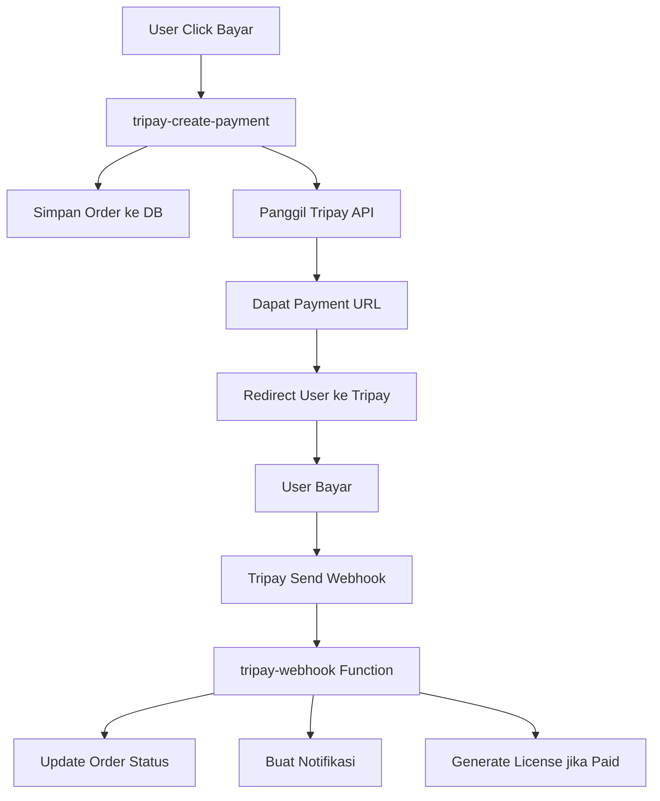

# Tutorial Setup Tripay Payment Gateway

## Daftar Isi
1. [Pendahuluan](#pendahuluan)
2. [Persiapan Akun Tripay](#persiapan-akun-tripay)
3. [Konfigurasi API Keys](#konfigurasi-api-keys)
4. [Setup Backend (Edge Functions)](#setup-backend-edge-functions)
5. [Konfigurasi Webhook](#konfigurasi-webhook)
6. [Testing Payment](#testing-payment)
7. [Go Live Production](#go-live-production)
8. [Troubleshooting](#troubleshooting)

## Pendahuluan

Tripay adalah payment gateway Indonesia yang mendukung berbagai metode pembayaran:
- Virtual Account (BCA, Mandiri, BRI, BNI, CIMB, dll)
- E-Wallet (OVO, DANA, ShopeePay, LinkAja, dll)
- QRIS (Semua e-wallet dan bank)
- Retail (Alfamart, Indomaret)
- Bank Transfer

## Persiapan Akun Tripay

### 1. Daftar Akun Tripay
1. Kunjungi [https://tripay.co.id](https://tripay.co.id)
2. Klik "Daftar Sekarang" 
3. Isi form pendaftaran dengan data lengkap
4. Verifikasi email dan nomor telepon
5. Upload dokumen KTP dan NPWP (untuk akun bisnis)

### 2. Aktivasi Akun
- Tunggu proses verifikasi (1-3 hari kerja)
- Setelah disetujui, Anda akan mendapat akses ke dashboard
- Login ke [https://tripay.co.id/member](https://tripay.co.id/member)

## Konfigurasi API Keys

### 1. Ambil API Keys dari Dashboard Tripay

**Sandbox (Testing):**
1. Login ke dashboard Tripay
2. Pilih menu "API" > "API Keys"
3. Salin:
   - **API Key** (untuk autentikasi)
   - **Private Key** (untuk signature)
   - **Merchant Code** (identifier merchant)

**Production:**
- Sama seperti sandbox, tapi gunakan API keys dari menu Production

### 2. Tambahkan Secrets di Supabase

Jalankan perintah berikut di chat Lovable untuk menambahkan secrets:

```
Tolong tambahkan secrets berikut:
- TRIPAY_API_KEY
- TRIPAY_PRIVATE_KEY  
- TRIPAY_MERCHANT_CODE
- TRIPAY_MODE (isi dengan "sandbox" atau "production")
```

## Setup Backend (Edge Functions)

### 1. Edge Functions Sudah Dibuat

Sistem sudah memiliki 2 edge functions untuk Tripay:

**`tripay-create-payment`** - Membuat transaksi pembayaran
- Input: items (array produk), payment_method
- Output: payment_url, reference, dll
- Endpoint: `/functions/v1/tripay-create-payment`

**`tripay-webhook`** - Menerima notifikasi status pembayaran
- Digunakan oleh Tripay untuk update status
- Otomatis update order dan buat notifikasi
- Endpoint: `/functions/v1/tripay-webhook`

### 2. Cara Kerja Backend



## Konfigurasi Webhook

### 1. Setup Webhook URL di Dashboard Tripay

1. Login ke dashboard Tripay
2. Menu "Pengaturan" > "Callback URL"
3. Isi Callback URL: 
   ```
   https://[PROJECT-ID].supabase.co/functions/v1/tripay-webhook
   ```
4. Ganti `[PROJECT-ID]` dengan project ID Supabase Anda: `uoricbcevlvbvynejrsp`
5. Jadi URL lengkapnya:
   ```
   https://uoricbcevlvbvynejrsp.supabase.co/functions/v1/tripay-webhook
   ```

### 2. Test Webhook

Tripay menyediakan fitur test webhook di dashboard untuk memastikan webhook berjalan dengan benar.

## Testing Payment

### 1. Mode Sandbox

Dalam mode sandbox, gunakan nomor virtual account testing:
- **BCA VA**: 12345678901
- **Mandiri**: 1234567890123
- **BRI**: 123456789012345
- **BNI**: 1234567890123456

### 2. Test Flow Lengkap

1. Tambah produk ke keranjang
2. Pilih metode pembayaran (misal: BCA VA)
3. Klik "Bayar dengan [Metode]"
4. Sistem redirect ke halaman Tripay
5. Lakukan pembayaran simulasi
6. Cek apakah webhook diterima dan order terupdate

### 3. Monitoring

- Cek logs di Supabase Functions untuk debug
- Monitor tabel `orders` untuk status pembayaran
- Cek tabel `notifications` untuk notifikasi user

## Go Live Production

### 1. Ubah Mode ke Production

Update secret `TRIPAY_MODE` dari `sandbox` ke `production`

### 2. Update API Keys

Ganti semua API keys dengan yang dari menu Production di dashboard Tripay

### 3. Pengaturan Live

1. Aktifkan metode pembayaran yang diinginkan
2. Set fee/komisi sesuai kebutuhan
3. Konfigurasi settlement (pencairan dana)
4. Test dengan transaksi kecil terlebih dahulu

## Metode Pembayaran Tersedia

### Virtual Account
- `BRIVA` - BRI Virtual Account
- `BCAVA` - BCA Virtual Account  
- `MANDIRI` - Mandiri Virtual Account
- `BNIVA` - BNI Virtual Account
- `SMSVA` - SMS Virtual Account
- `CIMBVA` - CIMB Virtual Account

### E-Wallet & QRIS
- `QRIS` - Quick Response Indonesian Standard
- `SHOPEEPAY` - ShopeePay
- `LINKAJA` - LinkAja
- `DANA` - DANA

### Retail
- `ALFAMART` - Alfamart
- `INDOMARET` - Indomaret

### Bank Transfer
- `MYBANK` - Maybank Indonesia
- `BSIBANK` - Bank Syariah Indonesia

## Troubleshooting

### 1. Error "Tripay credentials not configured"
- Pastikan secrets TRIPAY_API_KEY, TRIPAY_PRIVATE_KEY, dan TRIPAY_MERCHANT_CODE sudah diset
- Cek di Supabase Dashboard > Settings > Edge Functions

### 2. Error "Invalid signature"
- Pastikan TRIPAY_PRIVATE_KEY benar
- Cek format private key (tanpa spasi atau karakter tambahan)

### 3. Webhook tidak diterima
- Pastikan callback URL sudah benar di dashboard Tripay
- Cek apakah ada firewall yang memblokir
- Test webhook manual dari dashboard Tripay

### 4. Payment URL tidak muncul
- Cek logs di edge function `tripay-create-payment`
- Pastikan format request sudah benar
- Cek apakah metode pembayaran tersedia

### 5. Logs untuk Debug

Untuk melihat logs edge functions:
1. Buka Supabase Dashboard
2. Menu "Edge Functions" 
3. Pilih function yang ingin dicek
4. Tab "Logs"

## Keamanan

### 1. Verifikasi Signature
- Semua webhook dari Tripay diverifikasi signature-nya
- Tidak akan memproses data jika signature tidak valid

### 2. HTTPS Required  
- Semua komunikasi menggunakan HTTPS
- Tripay hanya menerima callback URL HTTPS

### 3. IP Whitelist
- Opsional: bisa set IP whitelist di dashboard Tripay
- Tambahan keamanan untuk webhook

## Biaya & Komisi

### Sandbox
- Gratis untuk testing
- Tidak ada biaya transaksi

### Production  
- Komisi per transaksi bervariasi per metode pembayaran
- Biasanya 0.7% - 2.5% + Rp 500 - 4.000
- Cek detail di dashboard Tripay

## Support

### 1. Dokumentasi Tripay
- [API Documentation](https://tripay.co.id/developer)
- [Sandbox Testing](https://tripay.co.id/sandbox)

### 2. Support Tripay
- Email: support@tripay.co.id
- WhatsApp: Tersedia di dashboard
- Live Chat: Di website Tripay

### 3. Sistem Monitoring
- Dashboard realtime untuk monitoring transaksi
- Report harian/bulanan
- Export data transaksi

---

**Catatan Penting:**
- Selalu test di sandbox sebelum go live
- Backup database sebelum implementasi
- Monitor logs secara berkala
- Update API keys jika ada perubahan dari Tripay